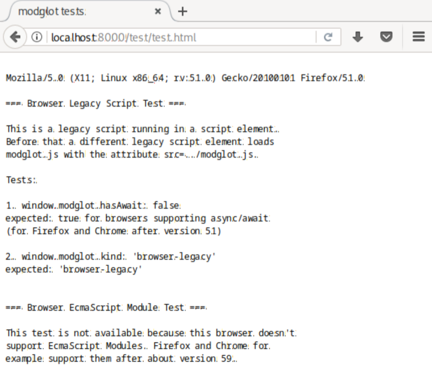

# JavaScript modules are messy

## Rambling introduction

Four module kinds seem to be important:

- EcmaScript modules for the browser (*Browser ESM*)
- Legacy scripts for the browser (*Browser Legacy*)
- EcmaScript modules for Node (*Node ESM*)
- CommonJs modules for Node (*CommonJS*)

There are some more module kinds:

- Asynchronous Module Definition (*AMD*)
- Universal Module Definition (*UMD*)
- Deno
- and some more I don't know about

Let's focus on the first six, however I don't know AMD at all, and
about UMD I know that it is a polyglot over AMD, Browser Legacy and
CommonJS, but *not* ESM.

Node has a bridge between ESM and CommonJS, so UMD also indirectly
convers ESM, but not in the browser.

**And that's what `modglot` is about!!**

What? A JavaScript module system for all!

One of my hats is the hat of the hobby front-end programmer who hates
bundlers when developing.

[Modern Web](https://modern-web.dev/) supports development without
bundling. I am happy. But for a math TypeScript project in the browser
[complex.js](https://github.com/infusion/Complex.js/blob/master/complex.js)
refuses to be assimilated. It is an old script and uses UMD.

I forked complex.js and added an `export` statement.

But this victory is somewhat shallow.

I also looked at JSPM (JavaScriptPackageManager?). It is nice.
[https://jspm.dev/complex.js] gives me an EcmaScript module.

Enough rambling now!

## What does this do?

It is an experiment to create a polyglot module: UMD and ESM!

It misuses the fact that `await` is parsed as an identifier when not in async
context nor in module. 

`if (false) await /1//1; export ...` is parsed in module as:

> `if (false)` `operator` `regex` `div` `1` `statement`

and in non-module top-level as: 

> `if (false)` `identifier` `div` `1` `comment`

It's not my idea. I found this ugly hack on
[StackOverflow](https://stackoverflow.com/questions/48396968/72314371).

It's there in 
[the EcmaScript specification](https://262.ecma-international.org/14.0/#sec-async-function-definitions).

We are lucky that async/await got introduced before EcmaScript modules.
Just imagine having a browser which does not support `await` but EcmaScript
modules...

😱

**Bonus question: Is this a good idea at all?**

😈

## Files

- `modglot.js` is both an UMD and an EcmaScript module.
- `test/test.mjs` is an EcmaScript module importing `modglot.js`
- `test/test.cjs` is a CommonJs script requiring `modglot.js`
- `test/loader.mjs` is a Node loader to force EcmaScript module kind
- `test/test_node.sh` is a test script using Node v6, v7 and v20
- `test/test.html` is a test page for browsers
- `test/dev-server` is a Python based dev-server to test for browsers

## Testing

These products should be tested for these cases:

- without async and esm:
  - Firefox version 51 (?)
  - Chrome version 51 (?)
  - Node version 6

- with async but without esm:
  - Firefox version 59 (?)
  - Chrome version 59 (?)
  - Node version 7

- with async and esm
  - Firefox version 114
  - Chrome version 114
  - Node version 20

`test/test_node.sh` automates the tests for Node, however I didn't manage
to automate for browsers. It got too complicated. For example geckodriver
0.27.0 for Selenium Webdriver only supports Firefox version 79 and newer.

I was able to run Firefox 51.

## Todo

TypeScript support!?

🙃
